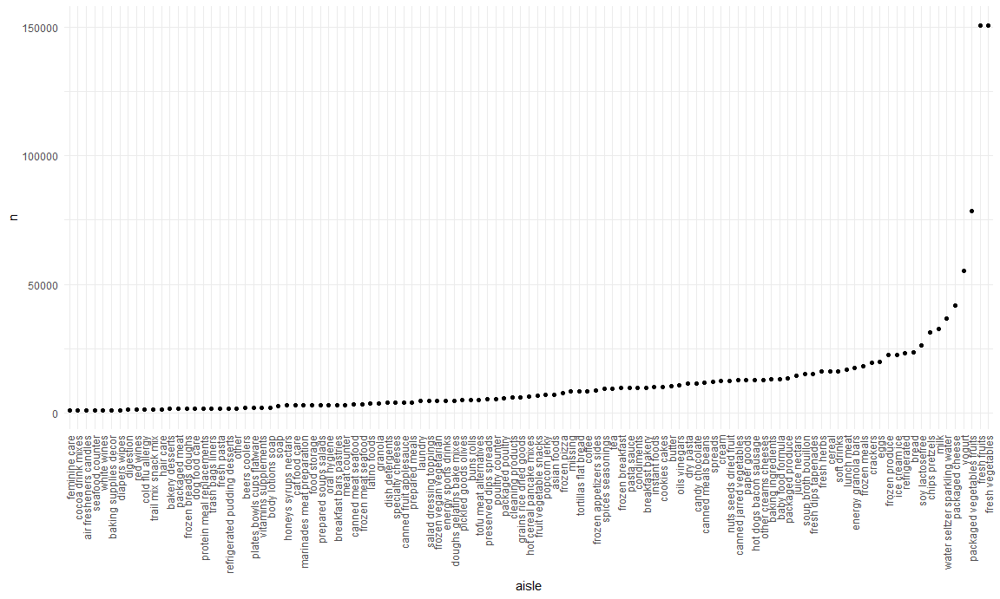
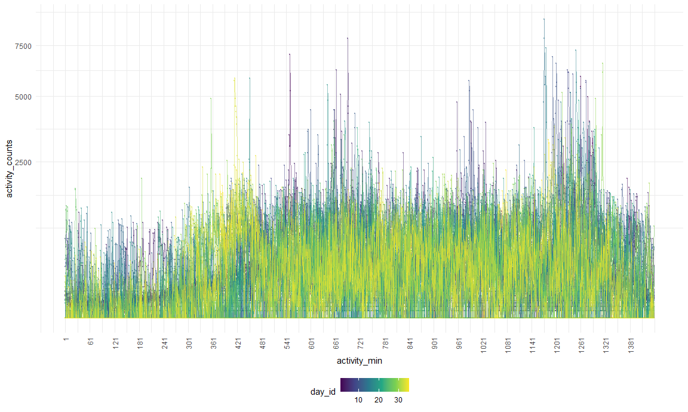
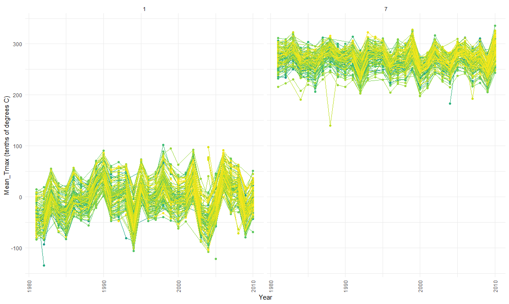
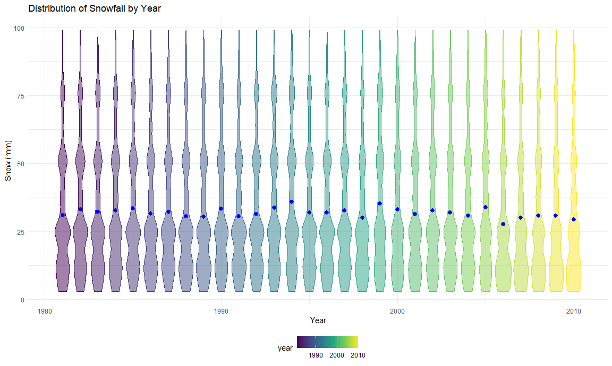

p8105\_hw3\_ww2579
================
Wenzhao Wu
10/10/2020

``` r
library(tidyverse)
```

    ## -- Attaching packages ---------------------------------- tidyverse 1.3.0 --

    ## v ggplot2 3.3.2     v purrr   0.3.4
    ## v tibble  3.0.3     v dplyr   1.0.2
    ## v tidyr   1.1.2     v stringr 1.4.0
    ## v readr   1.3.1     v forcats 0.5.0

    ## -- Conflicts ------------------------------------- tidyverse_conflicts() --
    ## x dplyr::filter() masks stats::filter()
    ## x dplyr::lag()    masks stats::lag()

``` r
library(p8105.datasets)
library(readxl)
data("ny_noaa")
library(patchwork)

knitr::opts_chunk$set(
  fig.width = 12,
  fig.asp = .6,
  out.width = "90%"
)

theme_set(theme_minimal() + theme(legend.position = "bottom"))

options(
  ggplot2.continuous.colour = "viridis",
  ggplot2.continuous.fill = "viridis"
)

scale_colour_discrete = scale_colour_viridis_d
scale_fill_discrete = scale_fill_viridis_d
```

## Problem 1

``` r
data("instacart")
```

This dataset contains 1384617 rows and `rcol(instacart)` columns.

Observations are the level of items in orders by user. There are user /
order variables – user ID, order ID, order day, and order hour. There
are also item variables – name, aisle, department, and some numeric
codes.

How many aisles, and which are most item from?

``` r
instacart %>%
  count(aisle) %>%
  arrange(desc(n))
```

    ## # A tibble: 134 x 2
    ##    aisle                              n
    ##    <chr>                          <int>
    ##  1 fresh vegetables              150609
    ##  2 fresh fruits                  150473
    ##  3 packaged vegetables fruits     78493
    ##  4 yogurt                         55240
    ##  5 packaged cheese                41699
    ##  6 water seltzer sparkling water  36617
    ##  7 milk                           32644
    ##  8 chips pretzels                 31269
    ##  9 soy lactosefree                26240
    ## 10 bread                          23635
    ## # ... with 124 more rows

Let’s make a plot

``` r
instacart %>%
  count(aisle) %>%
  filter(n > 1000) %>%  
  mutate(
    aisle = factor(aisle),
    aisle = fct_reorder(aisle, n)
  ) %>%
  ggplot(aes(x = aisle, y = n)) +
  geom_point() +
  theme(axis.text.x = element_text(angle = 90, vjust = 0.5, hjust = 1))
```



Let’s make a table\!

``` r
instacart %>%
  filter(aisle %in% c("baking ingredients", "dog food care", "packaged vegetables fruits")) %>%
  group_by(aisle) %>%
  count(product_name) %>%
  mutate(rank = min_rank(desc(n))) %>%
  filter(rank < 4) %>%
  arrange(aisle, rank) %>%
  knitr::kable()
```

| aisle                      | product\_name                                 |    n | rank |
| :------------------------- | :-------------------------------------------- | ---: | ---: |
| baking ingredients         | Light Brown Sugar                             |  499 |    1 |
| baking ingredients         | Pure Baking Soda                              |  387 |    2 |
| baking ingredients         | Cane Sugar                                    |  336 |    3 |
| dog food care              | Snack Sticks Chicken & Rice Recipe Dog Treats |   30 |    1 |
| dog food care              | Organix Chicken & Brown Rice Recipe           |   28 |    2 |
| dog food care              | Small Dog Biscuits                            |   26 |    3 |
| packaged vegetables fruits | Organic Baby Spinach                          | 9784 |    1 |
| packaged vegetables fruits | Organic Raspberries                           | 5546 |    2 |
| packaged vegetables fruits | Organic Blueberries                           | 4966 |    3 |

Apples vs ice cream.

``` r
instacart %>%
  filter(product_name %in% c("Pink Lady Apples", "Coffee Ice Cream")) %>%
  group_by(product_name, order_dow) %>%
  summarize(mean_hour = mean(order_hour_of_day)) %>%
  pivot_wider(
    names_from = order_dow,
    values_from = mean_hour
  )
```

    ## `summarise()` regrouping output by 'product_name' (override with `.groups` argument)

    ## # A tibble: 2 x 8
    ## # Groups:   product_name [2]
    ##   product_name       `0`   `1`   `2`   `3`   `4`   `5`   `6`
    ##   <chr>            <dbl> <dbl> <dbl> <dbl> <dbl> <dbl> <dbl>
    ## 1 Coffee Ice Cream  13.8  14.3  15.4  15.3  15.2  12.3  13.8
    ## 2 Pink Lady Apples  13.4  11.4  11.7  14.2  11.6  12.8  11.9

## Problem 2

Load, tidy, and wrangle the data.

``` r
tidied_df = 
  read_csv("./data/accel_data.csv") %>%
  janitor::clean_names() %>%
  pivot_longer(
    activity_1:activity_1440,
    names_to = "activity_min",
    values_to = "activity_counts",
    names_prefix = "activity_") %>%
  mutate(
    dow = case_when(
      day %in% c("Monday", "Tuesday", "Wednesday", "Thursday", "Friday") ~ "weekday",
      day %in% c("Saturday", "Sunday") ~ "weekend"),
    day = factor(day),
    dow = factor(dow),
    activity_min = as.numeric(activity_min))
```

    ## Parsed with column specification:
    ## cols(
    ##   .default = col_double(),
    ##   day = col_character()
    ## )

    ## See spec(...) for full column specifications.

``` r
tidied_df
```

    ## # A tibble: 50,400 x 6
    ##     week day_id day    activity_min activity_counts dow    
    ##    <dbl>  <dbl> <fct>         <dbl>           <dbl> <fct>  
    ##  1     1      1 Friday            1            88.4 weekday
    ##  2     1      1 Friday            2            82.2 weekday
    ##  3     1      1 Friday            3            64.4 weekday
    ##  4     1      1 Friday            4            70.0 weekday
    ##  5     1      1 Friday            5            75.0 weekday
    ##  6     1      1 Friday            6            66.3 weekday
    ##  7     1      1 Friday            7            53.8 weekday
    ##  8     1      1 Friday            8            47.8 weekday
    ##  9     1      1 Friday            9            55.5 weekday
    ## 10     1      1 Friday           10            43.0 weekday
    ## # ... with 50,390 more rows

This dataset contains 50400 rows and 6 columns.

It collects data of activity counts for each minute of a 24-hour day for
35 days (i.e. 5 weeks), with a total number of observations of 50400.

There are variables activity\_counts, activity\_min, day, day\_id, dow,
week included.

Data summary in an “untidy” table.

``` r
day_activity = tidied_df %>% 
  group_by(week, day) %>%
  summarise(activity_per_day = sum(activity_counts)) 
```

    ## `summarise()` regrouping output by 'week' (override with `.groups` argument)

``` r
xtabs(activity_per_day ~ week + day, data = day_activity)
```

    ##     day
    ## week    Friday    Monday  Saturday    Sunday  Thursday   Tuesday Wednesday
    ##    1 480542.62  78828.07 376254.00 631105.00 355923.64 307094.24 340115.01
    ##    2 568839.00 295431.00 607175.00 422018.00 474048.00 423245.00 440962.00
    ##    3 467420.00 685910.00 382928.00 467052.00 371230.00 381507.00 468869.00
    ##    4 154049.00 409450.00   1440.00 260617.00 340291.00 319568.00 434460.00
    ##    5 620860.00 389080.00   1440.00 138421.00 549658.00 367824.00 445366.00

After aggregating across minutes for each day, there are total 35
observations. One standing-out feature is that on Saturdays of week 4
and 5, the activity counts are both 1440 units per day, which is the
lowest sum of value.

Make a single-panel plot.

``` r
activity_plot = 
  tidied_df %>%
  ggplot(aes(x = activity_min, y = activity_counts, group = day_id, color = day_id),alpha = 0.4) +
  geom_point(size = 0.1, alpha = 0.4) +
  geom_line(alpha = 0.5) +
  scale_x_continuous(
    breaks = seq(1,1440,60)
  ) +
  scale_y_continuous(
    trans = "sqrt") +
  theme(axis.text.x = element_text(angle = 90, vjust = 0.5, hjust = 1))

activity_plot
```



Interpretations: From the graph above we can see that most of the data
are below 2500 units of activity counts within one day. In terms of the
overall trend, the activity counts are staying relatively low for about
the first 300 minutes (i.e. from midnight to 5am). There are much more
extreme values during the day, some of which are concentrated at 1201
min (i.e. 8pm). Then the activity counts decrease after 1321 min
(i.e. 10pm). There is no apparent association observed between day\_id
and activity counts, since lines are quite overlapped.

## Problem 3

``` r
ny_noaa = ny_noaa %>%
  separate(date, into = c("year", "month", "day"), convert = TRUE) %>%
  mutate(month = factor(month),
         tmax = as.numeric(tmax),
         tmin = as.numeric(tmin))
ny_noaa
```

    ## # A tibble: 2,595,176 x 9
    ##    id           year month   day  prcp  snow  snwd  tmax  tmin
    ##    <chr>       <int> <fct> <int> <int> <int> <int> <dbl> <dbl>
    ##  1 US1NYAB0001  2007 11        1    NA    NA    NA    NA    NA
    ##  2 US1NYAB0001  2007 11        2    NA    NA    NA    NA    NA
    ##  3 US1NYAB0001  2007 11        3    NA    NA    NA    NA    NA
    ##  4 US1NYAB0001  2007 11        4    NA    NA    NA    NA    NA
    ##  5 US1NYAB0001  2007 11        5    NA    NA    NA    NA    NA
    ##  6 US1NYAB0001  2007 11        6    NA    NA    NA    NA    NA
    ##  7 US1NYAB0001  2007 11        7    NA    NA    NA    NA    NA
    ##  8 US1NYAB0001  2007 11        8    NA    NA    NA    NA    NA
    ##  9 US1NYAB0001  2007 11        9    NA    NA    NA    NA    NA
    ## 10 US1NYAB0001  2007 11       10    NA    NA    NA    NA    NA
    ## # ... with 2,595,166 more rows

The most commonly observed values for snowfall (mm).

``` r
ny_noaa %>%
  count(snow) %>%
  arrange(desc(n))
```

    ## # A tibble: 282 x 2
    ##     snow       n
    ##    <int>   <int>
    ##  1     0 2008508
    ##  2    NA  381221
    ##  3    25   31022
    ##  4    13   23095
    ##  5    51   18274
    ##  6    76   10173
    ##  7     8    9962
    ##  8     5    9748
    ##  9    38    9197
    ## 10     3    8790
    ## # ... with 272 more rows

The most commonly observed value is “0” with a frequency of 2008508.

Jan vs July.

``` r
jj_plot = ny_noaa %>%
  filter(month %in% c("1","7")) %>%
  group_by(month,year,id) %>%
  summarize(
    mean_tmax = (mean(tmax,na.rm = TRUE))) %>%
  ggplot(aes(x = year, y = mean_tmax, group = id, color = id)) +
  geom_point() +
  geom_line() +
  geom_smooth(se = F) +
  facet_grid(~month) +
  labs(
    x = "Year",
    y = "Mean_Tmax (tenths of degrees C)") +
  theme(axis.text.x = element_text(angle = 90, vjust = 0.5, hjust = 1),
        legend.position = "none")
```

    ## `summarise()` regrouping output by 'month', 'year' (override with `.groups` argument)

``` r
jj_plot
```

    ## `geom_smooth()` using method = 'loess' and formula 'y ~ x'

    ## Warning: Removed 5970 rows containing non-finite values (stat_smooth).

    ## Warning in simpleLoess(y, x, w, span, degree = degree, parametric =
    ## parametric, : span too small. fewer data values than degrees of freedom.

    ## Warning in simpleLoess(y, x, w, span, degree = degree, parametric =
    ## parametric, : pseudoinverse used at 1986

    ## Warning in simpleLoess(y, x, w, span, degree = degree, parametric =
    ## parametric, : neighborhood radius 1.01

    ## Warning in simpleLoess(y, x, w, span, degree = degree, parametric =
    ## parametric, : reciprocal condition number 0

    ## Warning in simpleLoess(y, x, w, span, degree = degree, parametric =
    ## parametric, : There are other near singularities as well. 1.0201

    ## Warning in simpleLoess(y, x, w, span, degree = degree, parametric =
    ## parametric, : Chernobyl! trL>n 6
    
    ## Warning in simpleLoess(y, x, w, span, degree = degree, parametric =
    ## parametric, : Chernobyl! trL>n 6

    ## Warning in sqrt(sum.squares/one.delta): NaNs produced

    ## Warning in simpleLoess(y, x, w, span, degree = degree, parametric =
    ## parametric, : span too small. fewer data values than degrees of freedom.

    ## Warning in simpleLoess(y, x, w, span, degree = degree, parametric =
    ## parametric, : at 2009

    ## Warning in simpleLoess(y, x, w, span, degree = degree, parametric =
    ## parametric, : radius 2.5e-005

    ## Warning in simpleLoess(y, x, w, span, degree = degree, parametric =
    ## parametric, : all data on boundary of neighborhood. make span bigger

    ## Warning in simpleLoess(y, x, w, span, degree = degree, parametric =
    ## parametric, : pseudoinverse used at 2009

    ## Warning in simpleLoess(y, x, w, span, degree = degree, parametric =
    ## parametric, : neighborhood radius 0.005

    ## Warning in simpleLoess(y, x, w, span, degree = degree, parametric =
    ## parametric, : reciprocal condition number 1

    ## Warning in simpleLoess(y, x, w, span, degree = degree, parametric =
    ## parametric, : at 2010

    ## Warning in simpleLoess(y, x, w, span, degree = degree, parametric =
    ## parametric, : radius 2.5e-005

    ## Warning in simpleLoess(y, x, w, span, degree = degree, parametric =
    ## parametric, : all data on boundary of neighborhood. make span bigger

    ## Warning in simpleLoess(y, x, w, span, degree = degree, parametric =
    ## parametric, : There are other near singularities as well. 2.5e-005

    ## Warning in simpleLoess(y, x, w, span, degree = degree, parametric =
    ## parametric, : zero-width neighborhood. make span bigger
    
    ## Warning in simpleLoess(y, x, w, span, degree = degree, parametric =
    ## parametric, : zero-width neighborhood. make span bigger

    ## Warning: Computation failed in `stat_smooth()`:
    ## NA/NaN/Inf in foreign function call (arg 5)

    ## Warning in simpleLoess(y, x, w, span, degree = degree, parametric =
    ## parametric, : span too small. fewer data values than degrees of freedom.

    ## Warning in simpleLoess(y, x, w, span, degree = degree, parametric =
    ## parametric, : pseudoinverse used at 1986

    ## Warning in simpleLoess(y, x, w, span, degree = degree, parametric =
    ## parametric, : neighborhood radius 1.01

    ## Warning in simpleLoess(y, x, w, span, degree = degree, parametric =
    ## parametric, : reciprocal condition number 0

    ## Warning in simpleLoess(y, x, w, span, degree = degree, parametric =
    ## parametric, : There are other near singularities as well. 1.0201

    ## Warning in simpleLoess(y, x, w, span, degree = degree, parametric =
    ## parametric, : span too small. fewer data values than degrees of freedom.

    ## Warning in simpleLoess(y, x, w, span, degree = degree, parametric =
    ## parametric, : pseudoinverse used at 1981

    ## Warning in simpleLoess(y, x, w, span, degree = degree, parametric =
    ## parametric, : neighborhood radius 2.025

    ## Warning in simpleLoess(y, x, w, span, degree = degree, parametric =
    ## parametric, : reciprocal condition number 0

    ## Warning in simpleLoess(y, x, w, span, degree = degree, parametric =
    ## parametric, : There are other near singularities as well. 9.1506

    ## Warning in simpleLoess(y, x, w, span, degree = degree, parametric =
    ## parametric, : span too small. fewer data values than degrees of freedom.

    ## Warning in simpleLoess(y, x, w, span, degree = degree, parametric =
    ## parametric, : at 2009

    ## Warning in simpleLoess(y, x, w, span, degree = degree, parametric =
    ## parametric, : radius 2.5e-005

    ## Warning in simpleLoess(y, x, w, span, degree = degree, parametric =
    ## parametric, : all data on boundary of neighborhood. make span bigger

    ## Warning in simpleLoess(y, x, w, span, degree = degree, parametric =
    ## parametric, : pseudoinverse used at 2009

    ## Warning in simpleLoess(y, x, w, span, degree = degree, parametric =
    ## parametric, : neighborhood radius 0.005

    ## Warning in simpleLoess(y, x, w, span, degree = degree, parametric =
    ## parametric, : reciprocal condition number 1

    ## Warning in simpleLoess(y, x, w, span, degree = degree, parametric =
    ## parametric, : at 2010

    ## Warning in simpleLoess(y, x, w, span, degree = degree, parametric =
    ## parametric, : radius 2.5e-005

    ## Warning in simpleLoess(y, x, w, span, degree = degree, parametric =
    ## parametric, : all data on boundary of neighborhood. make span bigger

    ## Warning in simpleLoess(y, x, w, span, degree = degree, parametric =
    ## parametric, : There are other near singularities as well. 2.5e-005

    ## Warning in simpleLoess(y, x, w, span, degree = degree, parametric =
    ## parametric, : zero-width neighborhood. make span bigger
    
    ## Warning in simpleLoess(y, x, w, span, degree = degree, parametric =
    ## parametric, : zero-width neighborhood. make span bigger

    ## Warning: Computation failed in `stat_smooth()`:
    ## NA/NaN/Inf in foreign function call (arg 5)

    ## Warning: Removed 5970 rows containing missing values (geom_point).

    ## Warning: Removed 5640 row(s) containing missing values (geom_path).



Interpretations: There is no obvious increasing or decreasing trend
observed across years. Both means of tmax in January and July display a
“zigzag” graph, of which the data show a greater fluctuation in
January during this time period. Also, it can be easily seen from the
graph that the mean max temperature in July is significantly higher than
that in January. In 1994 and 2004, the average max temperatures in
January seem to have a bigger drop from the previous years when compared
to other years. However, it is not easy to tell from this figure about
which stations usually having higher or lower temperatures. In addition,
outliers might include some extreme values, such as the one in July in
1988, and the one in January in 1982.

Make a two-panel plot.

``` r
mean_temp_plot = ny_noaa %>%
  ggplot(aes(x = tmin, y = tmax)) +
  geom_point() +
  geom_hex() +
  labs(
    title = "Max_Temp vs Min_Temp",
    x = "Min_Temp (tenths of degrees C)",
    y = "Max_Temp (tenths of degrees C)")

mean_temp_plot
```

    ## Warning: Removed 1136276 rows containing non-finite values (stat_binhex).

    ## Warning: Removed 1136276 rows containing missing values (geom_point).


``` r
snow_plot = 
  ny_noaa %>%
  filter(snow > 0  & snow < 100 ) %>%
  ggplot(aes(x = year, y = snow, group = year, colour = year)) +
  geom_violin(aes(fill = year), alpha = .5) + 
  stat_summary(fun = "mean", color = "blue")+
  labs(x = "Year", y = "Snow (mm)", title = "Distribution of Snowfall by Year")

snow_plot
```

    ## Warning: Removed 30 rows containing missing values (geom_segment).



``` r
mean_temp_plot+snow_plot
```

    ## Warning: Removed 1136276 rows containing non-finite values (stat_binhex).
    
    ## Warning: Removed 1136276 rows containing missing values (geom_point).

    ## Warning: Removed 30 rows containing missing values (geom_segment).


Interpretations: The max temperature and min temperature are
proportional to each other as the graph shown above. The snowfall (mm)
in NYC is mainly distributed below 37.5 mm (within the interval (0,100))
and staying stable over years.
